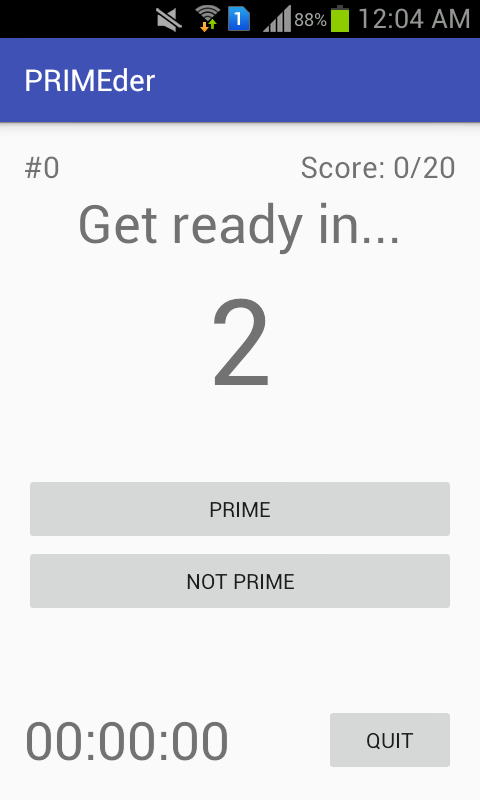

# PRIMEder
Test your knowledge on prime numbers with this Android mobile app!

## Pre-requisites and Requirements
- Java 7 or 8
- Android Studio
- Any Android-native mobile device/tablet with IceCream as a minimum API level

## Screenshots
  
 

## Installation
Here's how to install the app in your Android device:
1. Navigate through: `src > main > java > eecs > primeder` and then load these four files: `ChallengeActivity.java`, `ChallengeModel.java`, `EndActivity.java`, `HomeActivity.java` into Android Studio.
2. Connect your Android device to your computer and set it into developer mode.
3. In Android Studio, click on `Select Run/Debug Configuration`. Then click on `Run App`.
4. Wait until the app compiles and loads onto your device. The app will open as soon as this step is done.

## Game Modes
- **Challenge Mode** - identify whether the number presented to you is prime or not, how many can you get out of 20? 
- **Timed Mode** - how many primes can you identify correctly in 60 seconds? (Coming Soon!)
- **Sudden Death** - how many primes can you identify correctly before making your first mistake? (Coming Soon!)

## Video Demo

## License
Apache License  
Version 2.0, January 2004  
http://www.apache.org/licenses/  
A permissive license whose main conditions require preservation of copyright and license notices. Contributors provide an express grant of patent rights. Licensed works, modifications, and larger works may be distributed under different terms and without source code.
